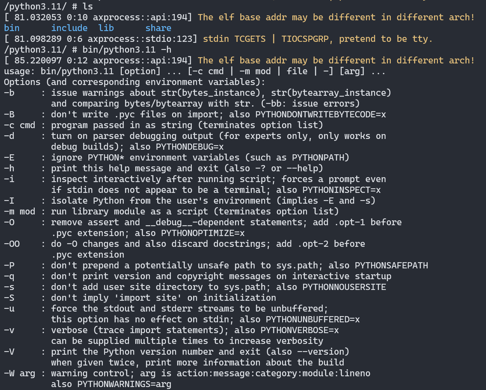
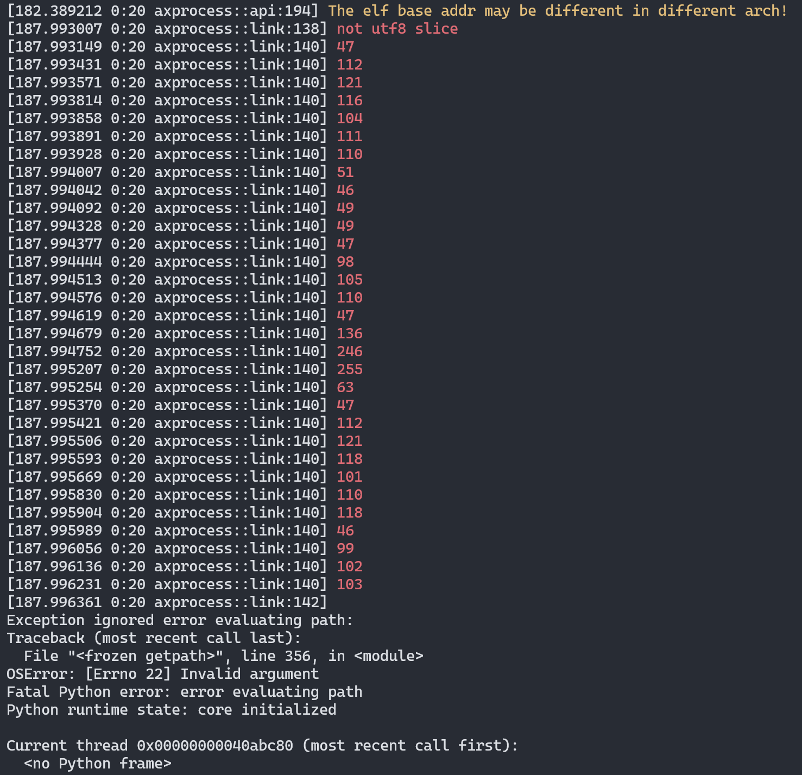
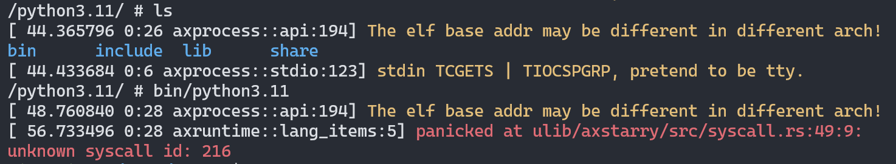

# python-lab

## 实习任务
实现任务包括：
* 分析支持python3.11程序的syscall系统调用。
* 在[ArceOS/Starrry](https://github.com/Arceos-monolithic/Starry)系统上，逐步完成下列过程，完善每个步骤中python3.11程序所依赖的syscall系统调用，以及，以内核实现的syscall与用户态程序的正常交互为实现目标。

## 交叉编译用户态程序
以`aarch64`架构为例，编译出ArceOS/Starry可用的用户态程序

`Python-3.11.8`在交叉编译阶段，会报如下库的依赖： `libffi`, `zlib`, `libuuid`, `xz`. 故需要依赖库也需要交叉编译。

### 安装依赖工具
编译所需的工具包括：
对于架构的交叉编译器，如`aarch64`架构可下载：`https://musl.cc/aarch64-linux-musl-cross.tgz`

Linux发行版系统环境安装`python3.11`，是的，交叉编译Python-3.11依赖于本机先安装好`python3.11`。

测试运行时，需要安装模拟器`Qemu`.

### 编译用户态程序

交叉编译`aarch64`架构的`Python-3.11.8`程序为示例，程序最终生成在目录`/opt/python3.11`

* 编译依赖库

依赖库的源代码压缩包放在目录`apk`，编译前请先解压。

其中，编译`zlib`
```
ARCH=aarch64
VER=python3.11

install_dir=/opt/${VER}
toolchain=${ARCH}-linux-musl
jobs=8

cd zlib
CROSS_PREFIX="${toolchain}-"  ./configure --prefix=${install_dir}
make -j${jobs} && make install
```
编译余下的依赖库，具有相似的配置configure
```
./configure --host=${toolchain} --enable-static=yes --prefix=${install_dir} 
make -j${jobs} && make install
```

至此，所有的`Python-3.11.8`依赖库都编译完成，并放置于目录`/opt/python3.11`

* 编译Python3

引入Python3依赖库的路径，至于环境变量中
```
export PKG_CONFIG_PATH=${install_dir}/lib/pkgconfig

unset CFLAGS LDFLAGS
export CFLAGS+=" -I${install_dir}/include/"
```

编译Python3程序

```
cd Python3

echo '
ac_cv_file__dev_ptmx=yes
ac_cv_file__dev_ptc=no
' > ./CONFIG_SITE # 配置的config设置

./configure --prefix=${install_dir} --with-build-python=${VER} --build=x86_64 --host=${toolchain} \
--enable-ipv6 CONFIG_SITE=./CONFIG_SITE --enable-optimizations
make -j8 && make install 
```
以上便是用户态程序的所有编译过程，这个过程我也写成了自动脚本，直接执行就能完成所有编译：`build.sh`

`Python-3.11.8`编译完成后，所有程序和库都放置于目录`/opt/python3.11`

## 试验

* Qemu模拟环境
准备程序运行的Qemu模拟环境，这里我提供了`aarch64`架构的`Alpine Linux`，类似ArceOS/Starry的`musl libc`环境。

`Alpine Linux`可以方便地在用户态程序适配的过程中，进行试验对比。
`aarch64`架构的`Alpine Linux`系统镜像下载：https://cloud.tsinghua.edu.cn/f/8da0e9ab50d4489f870e/?dl=1

系统镜像登录的用户名密码都是`root`

Qemu运行命令:
```
qemu-system-aarch64 -m 512 -cpu cortex-a53 -M virt -serial mon:stdio -nographic -bios /usr/share/qemu-efi-aarch64/QEMU_EFI.fd -netdev user,hostfwd=tcp::2222-:22,id=eth0 -device virtio-net-device,netdev=eth0 -hda rootfs-alpine.qcow2
```

* 执行测试

将交叉编译生成的Python3程序和库，打包目录`/opt/python3.11`，放置到Qemu运行的系统中。可以通过挂载rootfs复制的方式，也可以通过scp网络传输的方式；

编译生成的Python3程序和库的目录比较大，可以先做个瘦身，减小体积：
```
cd /opt/python3.11

rm lib/*.a lib/*/*.a lib/*/*/*.a
# rm -r lib/python3.11/test
rm -r `find -name __pycache__`

aarch64-linux-musl-strip -s bin/* lib/* lib/python3.11/lib-dynload/*
```

执行Python3程序测试
```
bin/python3.11 lib/python3.11/test/test___all__.py
```

## 实习任务内容

### **分析支持python3.11程序的syscall系统调用。**

syscall系统调用的情况统计，可以在Linux上使用strace，将统计于.txt文件中：
```
strace -f -c -o python3_syscall.txt python3.11 xx
```

每个syscall在相应架构上都有唯一的ID号，如`aarch64`架构的syscall ID可以查询：
https://git.musl-libc.org/cgit/musl/tree/arch/aarch64/bits/syscall.h.in

这里在Linux上统计，通过Python3程序完整测试的所有syscall包括：
```
% time     seconds  usecs/call     calls    errors syscall
------ ----------- ----------- --------- --------- ----------------
 15.62    0.195620          68      2871           munmap
 15.62    0.195603          43      4548           read
 14.94    0.187089         108      1727           write
 12.17    0.152348          30      4932       407 newfstatat
  8.17    0.102366          41      2486        10 openat
  7.66    0.095900          31      3065           mmap
  6.95    0.086984          19      4572           fstat
  6.30    0.078894          17      4521         3 lseek
  4.62    0.057879          23      2477           close
  3.29    0.041178          16      2481           fcntl
  3.08    0.038519          16      2285      2258 ioctl
  1.06    0.013322          37       355           getdents64
  0.16    0.002032          31        65           rt_sigaction
  0.15    0.001913          39        48           mprotect
  0.04    0.000535          44        12           unlinkat
  0.03    0.000369          33        11           brk
  0.03    0.000366          61         6         6 readlinkat
  0.02    0.000233          21        11           getcwd
  0.01    0.000161          32         5           rt_sigprocmask
  0.01    0.000144          48         3         1 faccessat
  0.01    0.000143          47         3           fsetxattr
  0.01    0.000113          22         5           uname
  0.01    0.000098          98         1           linkat
  0.01    0.000086          10         8           getrandom
  0.01    0.000084           9         9           getpid
  0.01    0.000066          66         1           readv
  0.00    0.000055          18         3           geteuid
  0.00    0.000040          40         1           mkdirat
  0.00    0.000035          17         2           prlimit64
  0.00    0.000032          32         1           setxattr
  0.00    0.000000           0         1           symlinkat
  0.00    0.000000           0         1           epoll_create1
  0.00    0.000000           0         4           fchmodat
  0.00    0.000000           0         1           sendfile
  0.00    0.000000           0         1           set_tid_address
  0.00    0.000000           0         1           getuid
  0.00    0.000000           0         1           getgid
  0.00    0.000000           0         1           socket
  0.00    0.000000           0         1           bind
  0.00    0.000000           0         2           gettid
  0.00    0.000000           0         1           getegid
  0.00    0.000000           0         1           execve
------ ----------- ----------- --------- --------- ----------------
100.00    1.252207          34     36531      2685 total
```

### **在ArceOS/Starrry系统上，逐步完成下列过程，完善每个步骤中python3.11程序所依赖的syscall系统调用，以及，以内核实现的syscall与用户态程序的正常交互为实现目标。**


1. 先运行一个简单的help命令`python3.11 -h`，看Starry是否能支持起来，发现当前以及可以。


2. 再尝试做一下python脚本的解析, 正常应该有脚本的介绍字符输出；
```
python3.11 pydoc3.11
```


3. 执行`python3.11`尝试一下python的交互模式，查看交互模式是否执行正常；


4. 最终目标，顺利通过Python3程序完整测试
```
bin/python3.11 lib/python3.11/test/test___all__.py
```

预期通过的输出：
```
xiao:~/python3.11# bin/python3.11 lib/python3.11/test/test___all__.py
__hello__
__phello__
__phello__.spam
_aix_support
_bootsubprocess
_collections_abc
_compat_pickle
_compression
_markupbase
_osx_support
_py_abc
_pydecimal
_pyio
_sitebuiltins
_strptime
_sysconfigdata__linux_aarch64-linux-gnu
_threading_local
_weakrefset
abc
aifc
antigravity
argparse
ast
asynchat
asyncio
asyncio.__main__
asyncio.base_events
...
----------------------------------------------------------------------
Ran 1 test in 28.237s

OK
```